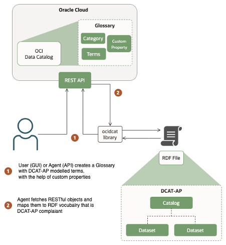

# OCI Datacatalog & DCAT Application Profile Technical Enabler

The purpose of this document is to propose how an organization can use the service OCI DataCatalog as the metadata store for an Application Profile of a Service delivered by an organization.

#### Glossary
-	`DCAT Application Profile (DCAT-AP)`: The DCAT Application profile for data portals in Europe (DCAT-AP) is a specification based on the Data Catalogue vocabulary (DCAT) for describing public sector datasets in Europe. Its basic use case is to enable cross-data portal search for data sets and make public sector data better searchable across borders and sectors. This can be achieved by the exchange of descriptions of datasets among data portals.
-	`OCI DataCatalog(OCI-DCAT)`: Oracle Cloud Infrastructure (OCI) Data Catalog is a metadata management service that helps data professionals discover data and support data governance. Designed specifically to work well with the Oracle ecosystem, it provides an inventory of assets, a business glossary, and a common metastore for data lakes.
-	`RDF`: The Resource Description Framework (RDF) defines a language for describing relationships among resources in terms of named properties and values.

## Concept
OCI-DCAT and the DCAT-AP operate on different levels. OCI-DCAT is a service used to extract metadata from storage solutions (databases, object-based storage, etc.) and make it available to internal stakeholders so they can discover what data is available in those sources. On the other hand, DCAT-AP is a standard to document dataservices and datasets (API’s, public assets, etc.) that an organization offers to the public or external stakeholders.

Even though the intended public of each one of them is different, this document describes how an organization could use metadata stored in OCI-DCAT as the basis to publish an DCAT-AP document in machine readable format so it can be published in an AP database like data.norge.no.

## Logical description
OCI-DCAT has two main components
-	Metadata store
-	Glossary

A glossary can be used to model any kind of hierarchically structured system (e.g. a library inventory system). Since DCAT-AP is a hierarchical system, it can be modeled using OCI-DCAT glossaries, using its relationship and custom properties capabilities.

A DCAT-AP stored in an OCI-DCAT glossary can be programmatically manipulated using the OCI REST API. This allows for a software component to transform a description according to DCAT-AP from REST objects to RDF format.

A collateral advantage of such implementation, is the fact that an organization can use OCI-DCAT glossaries with the DCAT-AP model, to connect them to the metadata harvested from it’s data sources; allowing to have a better observability on 
-	Which internal storage system owns data that is being used by a dataservice published as an DCAT-AP
-	Which internal stakeholder owns data offered by a dataservice published as an DCAT-AP

> Figure 1: Logical overview of library interaction with OCI DCAT and a DCAT-AP RDF description file.

## Technical implementation
### 1. Create an OCI-DCAT glossary modeled by the DCAT-AP specification
| OCI DCAT | DCAT-AP |
| --- | --- |
| Glossary | Catalog |
| Category | Dataset |
| N/A | Distribution |
| N/A | Actor |
| N/A | Kind |
| N/A | Dataservice |
| N/A | LegalResource |

> Table 1: Table mapping between OCI DCAT Glossary entities and DCAT-AP classes

In this [proposal](#t1), only Catalog and Dataset objects in the DCAT-AP can be modeled in OCI-DCAT. The other objects do not have a relevant mapping, because they are used in the context of how data is distributed, which is not in the scope of OCI-DCAT.

Custom properties in OCI-DCAT can be used to add the extra properties that are mandatory. In the tables below it is described how.

| OCI DCAT (Glossary) | DCAT-AP-NO (dcat:Catalog) | Value |
| --- | --- | --- |
| description | dct:description |
| displayName | dct:title |
| (Custom Property) rdf:type | rdf:type | dcat:Catalog
| (Custom Property) dct:identifier | dct:identifier | 
| (Custom Property) URI | URI |
| (Custom Property) Dataservice | Dataservice |
| (Custom Property) LegalResource| LegalResource |

> Table 2: Table mapping between OCI DCAT Glossary entities and DCAT-AP classes

| OCI DCAT (Category) | DCAT-AP-NO (dcat:Dataset) | Value |
| --- | --- | --- |
| description | dct:description |
| displayName | dct:title |
| (Custom Property) dcat:theme | dcat:theme |
| (Custom Property) rdf:type | rdf:type | `dcat:Dataset`
| (Custom Property) dct:identifier | dct:identifier |
| (Custom Property) dct:Publisher | dct:Publisher | URL string to the publisher
| (Custom Property) dct:ContactPoint| dcat:ContactPoint | An email address
| (Custom Property) URI | URI |

> Table 3: Table mapping between OCI DCAT Glossary entities and DCAT-AP classes

#### 1a. Another mandatory object in DCAT-AP
In this proposal, the objects
•	Distribution
•	Actor
•	Kind
•	DataService
•	LegalResource
Do not have a relevant mapping in OCI-DCAT, it is suggested that such information is provided as a flattened property either in a Glossary or a Category
But most of them can be represented as a single `string` custom property in OCI DCAT, and the library would be responsible of _expading_ as an separate term in the RDF generated file and viceversa.

| DCAT-AP-NO Parent class | DCAT-AP-NO Property | DCAT-AP-NO type | DCAT-AP-NO Mapped property | OCI DCAT Custom Property Type | OCI DCAT Parent Object | Custom Property Example Value |
| --- | --- | --- | --- | --- | --- | --- |
| dcat:Catalog | dct:contactPoint | vcard:Kind | vcard:fn | `string` | Glossary | `John Doe` |
| dcat:Catalog | dct:publisher | foaf:Agent | foaf:name | `string` | Glossary | `ACME A/S` |
| dcat:Dataset | dcat:contactPoint | vcard:Kind | vcard:fn | `string` | Category | `John Doe` |
| dcat:Dataset | dct:publisher | foaf:Agent | foaf:name | `string` | Category | `ACME A/S` |

### 2. Export OCI-DCAT Glossary using OCI REST API
OCI-DCAT API has the following relevant REST operations for retrieval of glossary related objects:
-	`GetGlossary` | [Oracle Cloud Infrastructure API Reference and Endpoints](https://docs.oracle.com/en-us/iaas/api/#/en/data-catalog/20190325/Glossary/GetGlossary)
-	`ListTerms` | [Oracle Cloud Infrastructure API Reference and Endpoints](https://docs.oracle.com/en-us/iaas/api/#/en/data-catalog/20190325/Term/ListTerms)
-	`GetTerm` | [Oracle Cloud Infrastructure API Reference and Endpoints](https://docs.oracle.com/en-us/iaas/api/#/en/data-catalog/20190325/Term/GetTerm)

### 3. Identifiers generated by OCI
> NB! Work in progress

When creating a Glossary term, OCI generates a key. This could be used to create a random key used as an inmutable string to be used as part of the URI of the RDF objects. But special considerations has to be made for it's use.